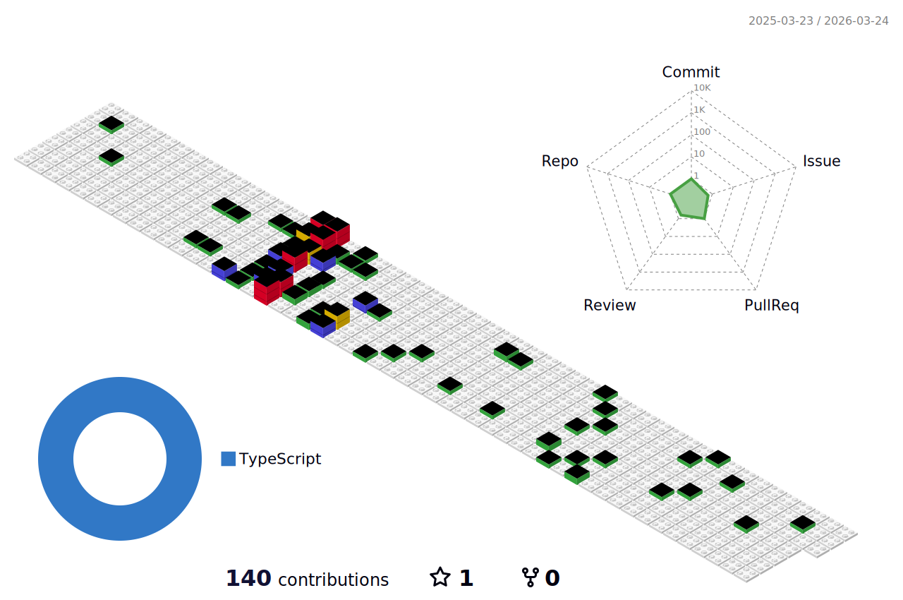

### Hi there 👋

<!--
**Hellokugou520/Hellokugou520** is a ✨ _special_ ✨ repository because its `README.md` (this file) appears on your GitHub profile.

Here are some ideas to get you started:

- 🔭 I’m currently working on earth
- 🌱 I’m currently learning ...
- 👯 I’m looking to collaborate on ...
- 🤔 I’m looking for help with ...
- 💬 Ask me about ...
- 📫 How to reach me: ...
- 😄 Pronouns: ...
- ⚡ Fun fact: ...
-->

- 🚀 I use daily:
  
  
  
  
- 💻 I work using:
  
- ⚙️ I also use and work:
  
  
- 🌱 Learning all about:
  

